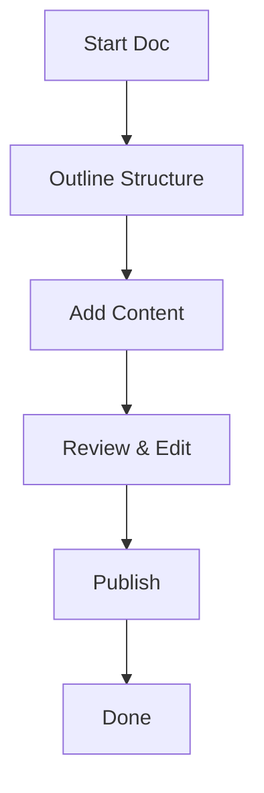

## Account and Access Issues

Resolve common login and permission problems quickly with these solutions.

<ExpandableGroup>
  <Expandable title="I forgot my password. How do I reset it?" default-open="true">

Follow these steps to regain access:

<Steps>
  <Step title="Navigate to Login" icon="login">
    Go to the Clarkemilyfbznj login page at `https://clarkemilyfbznj.com/login`.
  </Step>
  <Step title="Click Forgot Password" icon="key">
    Enter your email address and select `Forgot Password?`.
  </Step>
  <Step title="Check Email" icon="mail">
    Open the email from Clarkemilyfbznj and click the reset link. The link expires in `{24}` hours.
  </Step>
</Steps>

  </Expandable>

  <Expandable title="Why can't I access shared documents?">

Ensure you accept the invite link sent to your email. Check your spam folder if needed. Workspace admins control permissions—contact them to grant `{editor}` or `{viewer}` roles.

  </Expandable>

  <Expandable title="How do I change my email address?">

Log in, go to `Account Settings > Profile`, and update your email. Verify the new address via the confirmation email.

  </Expandable>
</ExpandableGroup>

<Callout kind="tip">
  Enable two-factor authentication (2FA) in `Account Settings > Security` to protect your account.
</Callout>

## Document Collaboration Tips

Collaborate effectively with your team using these proven strategies.

<Tabs>
  <Tab title="Real-Time Editing" icon="edit-3">
    Multiple users edit simultaneously. Changes appear instantly—use `@mentions` to notify teammates.

    ```javascript
    // Example: Mention a user in a code comment
    // @john.doe Review this API endpoint
    const fetchUserData = async (userId) => {
      const response = await fetch(`/api/users/{userId}`);
      return response.json();
    };
    ```

  </Tab>
  <Tab title="Version History" icon="git-branch">
    Access previous versions via the `History` panel. Restore or compare changes easily.

    <Image
      src="https://example.com/version-history-screenshot.png"
      alt="Version history panel showing document changes"
      width="800"
      height="400"
    />
  </Tab>
  <Tab title="Comments and Feedback" icon="message-circle">
    Add inline comments with `@thread` for discussions. Resolve threads when addressed.
  </Tab>
</Tabs>

## Troubleshooting Common Errors

Diagnose and fix issues step by step.

### Error: "Document Not Found"

<Steps>
  <Step title="Verify URL" icon="link">
    Check the document slug in the URL. Ensure no typos like `{doc-slug}`.
  </Step>
  <Step title="Check Permissions" icon="shield">
    Confirm you have `{viewer}` access. Ask the owner for sharing.
  </Step>
  <Step title="Clear Cache" icon="refresh-cw">
    Hard refresh your browser with `Ctrl+Shift+R` (Windows) or `Cmd+Shift+R` (macOS).
  </Step>
</Steps>

<Callout kind="alert" default-open="true">
  If errors persist, check the browser console for JavaScript issues: Press `F12` > `Console` tab.
</Callout>

### Error: Sync Conflicts

Use the `Resolve Conflicts` dialog to merge changes manually.

## Best Practices for Documentation

Follow these guidelines to create high-quality docs.

<Columns cols={2}>
  <Card title="Use Semantic Headings" icon="heading" horizontal>
    Structure content with H2 for sections, H3 for subsections. Improves navigation and SEO.
  </Card>
  <Card title="Embed Code Snippets" icon="code">
    Highlight key lines for clarity.

    <CodeGroup tabs="JavaScript,Python">
      ```javascript
      // Install via npm
      npm install clarkemilyfbznj-sdk
      ```
      ```python
      # Install via pip
      pip install clarkemilyfbznj-sdk
      ```
    </CodeGroup>
  </Card>
</Columns>

<Columns cols={3}>
  <Card title="Version Control" icon="git-commit" href="#">
    Always commit changes with descriptive messages like `Fix: Update API examples`.
  </Card>
  <Card title="Accessibility" icon="accessibility" href="#">
    Add alt text to images and use proper contrast ratios.
  </Card>
  <Card title="Search Optimization" icon="search" href="#">
    Include keywords naturally in headings and intros.
  </Card>
</Columns>



Adopt these practices to streamline your workflow and enhance readability across your Clarkemilyfbznj documentation.