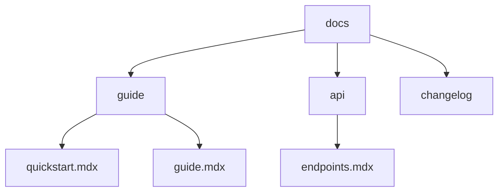

## Overview

Streamline your documentation workflow with Clarkemilyfbznj. You create structured projects, edit content efficiently, integrate version control, and organize files using folders and tags. This guide covers all essentials to keep your docs professional and up-to-date.

<Columns cols={3}>
  <Card title="Create Projects" icon="plus" href="#creating-projects">
    Set up new documentation spaces quickly.
  </Card>
  <Card title="Edit Documents" icon="edit-3" href="#editing-documents">
    Format and preview MDX content seamlessly.
  </Card>
  <Card title="Version Control" icon="git-branch" href="#version-control">
    Track changes with Git integration.
  </Card>
</Columns>

## Creating and Structuring Projects

Start by creating a new project to house your documentation.

<Steps>
  <Step title="Initialize Project" icon="folder-plus">

    Create a root directory and initialize Git.

````bash
mkdir clarkemilyfbznj-docs
cd clarkemilyfbznj-docs
git init
npm init -y
````

  </Step>
  <Step title="Set Up Docs Folder" icon="package">

    Add a `docs` folder and basic structure.

````bash
mkdir docs
touch docs/README.mdx
npm install -D @mdx-js/loader
````

  </Step>
  <Step title="Configure MDX" icon="settings">

    Update `package.json` for MDX support.

  </Step>
</Steps>

## Editing and Formatting Documents

Edit MDX files using your preferred tools. Focus on semantic formatting for better readability.

<Tabs>
  <Tab title="VS Code" icon="code">

    Install extensions for MDX preview.

<CodeGroup tabs="Terminal">
````bash
code --install-extension "antfu.vite" --force
code --install-extension "bradlc.vscode-tailwindcss" --force
````
</CodeGroup>

    Use headings, lists, and components like `<Callout>` for emphasis.

  </Tab>
  <Tab title="Web Editor" icon="globe">

    Access the online MDX editor directly in your browser.

    Preview changes live with hot reload enabled.

  </Tab>
</Tabs>

<Callout kind="tip">
  Always wrap special characters like `{API_KEY}` or `<100ms` in backticks to prevent parsing errors.
</Callout>

## Version Control Basics

Integrate Git to track changes and collaborate effectively.

<Steps>
  <Step title="Commit Changes" icon="git-commit">

````bash
git add docs/
git commit -m "Add initial guide.mdx"
````

  </Step>
  <Step title="Push to Remote" icon="git-pull-request">

    Connect to GitHub or GitLab.

````bash
git remote add origin https://github.com/yourusername/clarkemilyfbznj-docs.git
git push -u origin main
````

  </Step>
</Steps>

## Organizing Content with Folders and Tags

Structure your docs hierarchically for easy navigation.

| Folder       | Purpose                          | Example Files              |
|--------------|----------------------------------|----------------------------|
| `guide/`     | User guides and tutorials        | `quickstart.mdx`          |
| `api/`       | API references                   | `endpoints.mdx`           |
| `changelog/` | Release notes                    | `v1.0.0.mdx`              |

Use tags for cross-referencing content.

<ExpandableGroup>
  <Expandable title="Advanced Folder Structure" default-open="false">

    Visualize your project layout.



    Add a `tags.json` for metadata:

```json
{
  "tags": ["guide", "api", "tutorial"]
}
```

  </Expandable>
</ExpandableGroup>

Maintain consistency by reviewing structure weekly. This approach scales as your project grows.